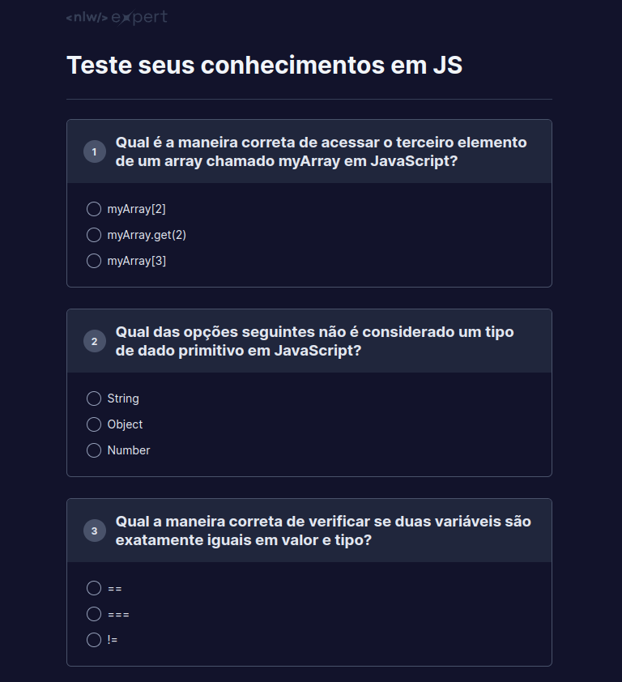

<h1 align="center">
    <a href="#" alt="...">NLW Expert- Teste de conhecimentos</a>
</h1>

<h3 align="center">

    Este projeto trata-se de um game p/ testar o seus conhecimentos na linguagem JavaScript.  

</h3>

  
  
  
   
   
  

<h4 align="center">
	🚧 STATUS: Projeto FINALIZADO 🚧
</h4>

## 💻 Sobre o projeto

**Teste de conhecimentos** é um jogo para testar as habilidades do usuário em JavaScript. 
O jogo é composto por 10 perguntas de multipla escolha e contém apenas 1 resposta certa para cada pergunta. 
Não possui nenhum limite de tentativas ou pontuação, ou seja, o usuário pode errar a mesma pergunta quantas vezes ele quiser. 
O intuito do jogo é fazer com que o usuário estimule o seu conhecimento em JS e vá atrás da resposta correta caso responda errado.

O projeto foi desenvolvido para colocar em prática os conhecimentos em HTML,CSS e principalmente em JavaScript (onde foi feito a maioria do código).

O projeto foi desenvolvido durante a NLW - Next Level Week oferecida pela [Rocketseat](https://www.rocketseat.com.br/). O NLW é uma experiência online com muito conteúdo prático, desafios onde o conteúdo fica disponível durante uma semana e te desafia a criar um projeto real e útil para compor o seu portifólio.

## ⚙️ Estrutura do projeto

- O projeto é composto por:
  - Uma página web: **(main.html)**
    - Utiliza HTML para estruturar a página do quiz.
    - Header: Apresenta o cabeçalho contendo o título do quiz e o logotipo.
    - Corpo do Quiz: A área principal onde as perguntas e opções de resposta são exibidas.
    - Contador de Acertos: Exibe o número de respostas corretas do usuário.
  - Um arquivo de estilização: **index.css**
    -Estilização Geral: Define estilos para a página, incluindo fontes, cores de fundo e margens.
    - Estilo do Header: Define estilos para o cabeçalho, como margens, bordas e cores.
    - Estilo do Quiz: Define estilos para as perguntas e respostas, incluindo margens, bordas, cores e layout.
    - Estilo dos Botões de Resposta: Define estilos para os botões de resposta, incluindo cores e efeitos visuais.
    - Estilo do Contador de Acertos: Define estilos para o contador de acertos na parte inferior da página.
  - Um arquivo: **index.js**
    - Gerenciamento das Perguntas: Armazena as perguntas, opções de resposta e respostas corretas em um array.
    - Renderização das Perguntas: Renderiza dinamicamente as perguntas e opções de resposta na página HTML.
    - Verificação de Respostas: Verifica se as respostas do usuário estão corretas e atualiza o contador de acertos.
    - Feedback ao Usuário: Fornece feedback visual ao usuário sobre suas respostas.
  - Uma pasta **(assets)** com as imagens utilizadas na construção da página web.

## 🎲 Funcionalidades

As funcionalidades desenvolvidas no projeto foram:

- [x] **Apresentação das Perguntas:** As perguntas são exibidas de forma clara e organizada na página, permitindo uma fácil compreensão.

- [x] **Seleção de Respostas:** Os usuários podem selecionar suas respostas dentre as opções fornecidas para cada pergunta.

- [x] **Verificação de Respostas:** Após selecionar uma resposta, o sistema verifica automaticamente se a opção escolhida está correta ou não.
 
- [x] **Feedback Visual:** O sistema fornece feedback visual imediato ao usuário, destacando se a resposta selecionada está correta ou não.

- [x] **Contador de Acertos:** Um contador na parte inferior da página mostra quantas respostas corretas o usuário já obteve em relação ao total de perguntas.

- [x] **Estilização Atraente:** A página é estilizada de forma atraente, com uso de cores, fontes e layout que tornam a experiência do usuário mais agradável.

- [x] **Responsividade:** O layout da página se adapta a diferentes tamanhos de tela, garantindo uma boa experiência de uso em dispositivos móveis e desktops.

- [x] **Performance:** O projeto é otimizado para garantir um carregamento rápido e uma execução suave, proporcionando uma experiência fluida ao usuário.

- [x] **Código Organizado:** O código HTML, CSS e JavaScript está bem organizado e comentado, facilitando a manutenção e o entendimento por parte de outros desenvolvedores.

## 🛠 Tecnologias

Foi utilizado na construção do projeto as seguintes tecnologias:

<code></code> **HTML**
<code></code> **CSS**
<code></code> **JavaScript**
<code></code> **Git**
<code></code> **GitHub**

## ✈️ Acesse a Página

Este projeto encontra-se hospedado na plataforma do [GitHub pages](https://pages.github.com/).

#### Pode ser visualizado clicando aqui: [NLW Expert - Teste de conhecimentos](https://bcadore.github.io/Teste-de-conhecimento/)

## 👀 Visualizando a Página

Abaixo é possível visualizar a página web desenvolvida:

## 🦸 Autor

<a href="https://github.com/bcadore">
    
     
    <b>Bernardo Cadore Ramires</b>
</a>

 

## 📝 Licença

Este projeto esta sobe a licença [MIT](./LICENSE).

 

❤️  <b>MUITO OBRIGADO</b> por visitar o meu projeto! ❤️

---